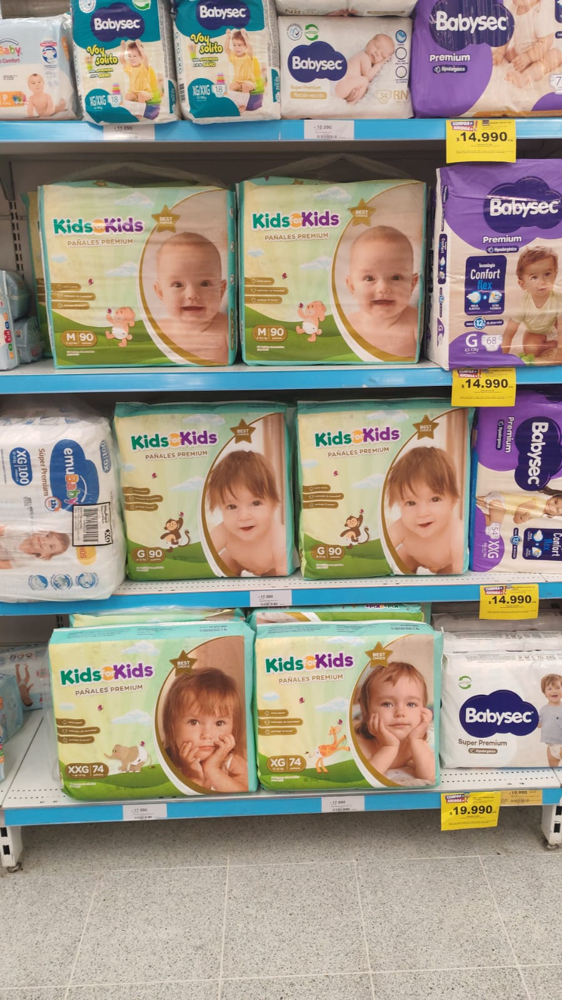
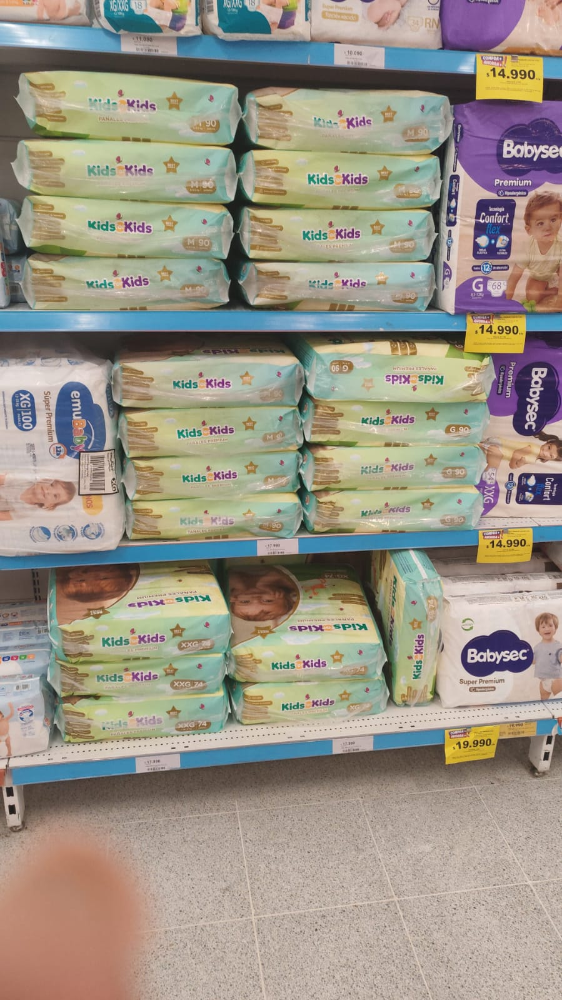

# Manual de tareas Operador sala / Super10

## CAJA

### General

Limpiar mi caja cuando entre y cuando salga de caja.

Poner letrero “caja cerradaˮ.

Pedir préstamo.

De caja no me puedo mover.

Para retiros cerrar la caja mientras cuento el dinero, también si es que se acaba el dinero. A los clientes que queden decirles “solo tarjeta, sin efectivoˮ.

No hacer retiro hasta que o se me acabe el dinero o se bloquee la caja , NO seguir la recomendación de “se recomienda retiroˮ (ya que suele hacerla muy “tempranoˮ)  Sodexo / Pluxe son lo mismo.

Envasar productos rotos

Con el ALCOHOL hay que recordar que SALE MENSAJE, APRETAR ACEPTAR para continuar con los productos que siguen. Los que vienen en caja pedir envase.
RECORDAR que JUNAEB son HASTA 2 SELLOS , LA DIFERENCIA LA PAGA EL CLIENTE CON OTRO MEDIO DE PAGO.

El “TBKˮ es para cuando sacan la Transbank y traen otra o se cae el sistema.
Operación manual.

A las 3 Bajar el Volumen presionando el botón de sonido 2 veces. A las 4 subirlo haciendo lo mismo.

Abrir rejilla. Cerrarla cuando me vaya a colación o salga de caja. Así como también bloquear el usuario.

Siempre limpiar la caja.

### Impresora en caja

Cambiar papel: abrir la cajita, poner el papel con la cola apuntando hacia mí, presionar “enterˮ y el botón “tecladoˮ.

Si se le acaba el papel a la impresora → decirle a la supervisora. Apagar la máquina.

### Manejo de precios y productos

Mandar a los clientes a la máquina de precios en pasillo 4 y 7 o preguntarle a la supervisora. (Recordar que al Supermercado lo evaluand por la cantidad de anulaciones y notas de credito).

Buscar por nombre el producto si no se escanea.

Si es carne u otro complicado de pasar por escaner, digitar el código de abajo.

Productos de pronto consumo (ej: yogures) se pasan uno por uno.

Los panes, aunque valgan lo mismo, deben ir en bolsas distintas (códigos diferentes).

Harinas de 25kg o productos pesados: buscarlos por pantalla. Si son más de 2 sacos de harina → registrar en el sistema.

Los productos con descuento se digitan primero con el código amarillo tapando el blanco, y luego el blanco tapando el amarillo.

Si un código de grupo no funciona, pasar uno y multiplicar. (Caso de las leches Trencito)

Si no dan RUT, no tienen derecho a nota de crédito. Por eso es importante pedir el Rut siempre , y en caso de emergencia digitar uno alternativo , ej: 1.111.111.111-1 o 3.333.333.333-3. Para alcohol: sirve carnet, pasaporte o licencia. Nunca foto.

Se pueden mezclar productos en oferta de la misma marca (ej: mermeladas Watts).

En productos de pronto consumo: si no lee el código blanco, digitar el del fleje amarillo de arriba y luego el blanco.

### Manejo de retornables y envases
Cuando me pasan retornables: primero pasar bebidas, después “devolver envasesˮ.

Si me pasan envases → hacer papelito por el N° de envases y firmar.

### Corredora Laser
Si la corredora empieza a moverse “lentoˮ , tengo que “amasarlaˮ por la parte de adelante y luego darle “golpecitosˮ por la parte de atrás (lado que da a caja). Esto sucede porque hay productos muy pesados y se atasca.

### Factura (Caja 4 y 5)

Cliente entrega RUT de factura y de la persona natural. 

Si el cliente no existe , ingresar los datos:

La razón social sale en el documento que el cliente debiese tener.

El “Giroˮ lo tengo que preguntar.

El Kino no pasa con factura. 

### Pagos
Efectivo: vuelto mínimo $5.000 (múltiplos de 5).

Transbank: botón rojo (anular) cuando se equivocaron y querían vuelto. Botón amarillo (borrar) para regresar atrás en contraseña.
RutPay / MercadoPago: el cliente escanea el QR en la pantalla.

Unipay: con huella digital. Se puede pagar con unipey una parte y con efectivo la otra. Si se paga tarjeta con Unipay, comprobar que el monto sea exacto (ni más ni menos)  en tanto el facturado sea 0 y el mínimo es 0. Sino es el caso , poner “otro montoˮ y dar vuelto si es que es mas.

Giftcard tarjeta: botón 4, deslizar, sale voucher, cliente firma → quedarse con copia.

Giftcard impresa (papel): seleccionar pago, escanear código, poner pin, monto, voucher.

Restricciones: tarjeta de debito o credito, no ambas juntas. 

Tarjeta HITES: comprobar datos de la persona, si no coinciden no se puede. NUNCA DE LOS JAMASES APRETAR “CANCELARˮ , “CONSULTAR SALDOˮ O PASAR LA TARJETA MAS DE 1 VEZ , YA QUE HAY UN BUG QUE CONGELA LA PANTALLA Y HAY QUE REINICIAR EL SISTEMA.

Tarjeta Unimarc: Es la tarjeta unipey. Se paga solo en efectivo.

CMR Falabella: crédito, cuotas a elección del cliente.

## Sala / Bodega / Reponedor (Sistema 4x1)

### Máxima
Limpiar, rotar , ordenar y reponer.

### PRINCIPALMENTE LA COMUNICACIÓN CON COMPAÑEROS EN SALA , PREGUNTAR TODO SI ES QUE NO HAY CERTEZA.

Si no hay nadie en caja, cerrarla y consultar en sala o con el jefe en la caseta.

Ver si hay pallets e ir reponiendo.

Fechas de productos: las más próximas adelante, las nuevas atrás.

Preguntar a los jefes si bajo un pallet con la transpaleta para trabajarlo y/o subir uno (con su respectivo cartel de fecha trabajado)

Ordenar con planograma (últimos 3 dígitos del código del producto).

### Cómo reponer
Al reponer, los productos deben quedar alineados, visibles y con las caras hacia el cliente.

Respetar siempre el planograma y la lógica de rotación (FEFO: Los primeros que vencen,  los primeros en ir adelante).

✅ Así debería quedar:

❌ Esto no es así:

📷 Ejemplo de planograma

Siempre las caras hacia adelante. 

### Aluzado

Para aluzar un pallet , tengo que estirar el aluza hasta el piso , amarrar una parte a un ala del pallet y luego envolver e ir subiendo hasta que quede cubierto.

### Mermas
Productos abiertos, vencidos o descompuestos → bolsa y carrito de merma.

Carrito de merma generalmente en el pasillo 5. (Devolución antes del cierre, por favor, LO MISMO CON LOS CARTONES)

Yogures → frigorífico 2.

Carnes y jamones → frigorífico 1.

Bebidas vencidas → carrito junto a la puerta de basura.

CAJA DE MERMAS ESTA ARRIBA , EN LA PARTE DE ATRÁS DE LOS PALLETS , JUNTO CON LAS BATERIAS PARA LA TRANSPALETA ELECTRICA.

Códigos merma (van en cajas plásticas con código respectivo en sala de mermas):

51: Consumo

53: Vencimiento

81: Hurto

55: Operacional

### Carnicería / Refrigeración
Nota importante: Para no cortar la cadena de frío en refrigeración/carnes, apilar los productos hasta la línea roja demarcada.

Si un cliente no lleva carnes o lácteos → guardar inmediatamente en el refrigerador de las bebidas en la esquina del  checkout.

### Uso de equipos
Pistola de radiofrecuencia

Usuario: 3518

Clave: s103518

Local: 3518

Geopricer (siempre)

Configuración: puerto siempre en 6101, IP la que indique la impresora. (Esta IP , cambia cada tantos minutos , estar pendiente para Volver a configuración y poner la nueva)

Después de configurar, sacar un fleje con cualquier producto antes de empezar a usarla.

Asegurarse de que la barra esté parpadeando en “EANˮ, si no → no lo saca.

Equipos:
Transpaleta manual

Para subir: giros completos de sube y baja con el manubrio.

Para bajar: apretar la palanquita al lado del manubrio.

Tener ojo con las marcas en el pallet y la transpaleta, para no romper la madera.

Transpaleta eléctrica

Revisar batería antes de usar. Si no hay carga, buscar baterías cargadas atrás de los pallets.

Encender con botón rojo.

Inclinar a 70° hacia atrás.

Botones blancos laterales → mover despacio hacia atrás (si se hace rápido, acelera mucho).

Botones delanteros → subir/bajar.

Cargas pesadas: mover un poco hacia arriba.

Seguridad: si el manubrio toca el pecho, la máquina se apaga (volver a apretar botón rojo).

📌 Extras

El operador de sala deja las mermas en las cajas correspondientes.

Entradas en la mañana por Arturo Prat; después de la 1, por entrada principal.

Cuidado con productos en oferta sin stock.

Mantener calma en caja, no hacer las cosas muy rápido.

Tener cuidado con presionar TBK.

Si hay problema con boletas, avisar inmediatamente.

Si falta espacio de algún producto , preguntar a los jefes. Lo mismo respecto a si hay que subir o bajar pallets , preguntar a los jefes.

En las mini-galletas ordenar bien (primera en entrar , primero en salir) , a pesar de que el cliente “revuelva” la cosa y queden 4 fechas combinadas (informar de las proximas a vencer a los jefes) Sugiero tomar fotos luego de ordenar la parte de las mini-galletas e informarlo.

## Glosario

Checkout:  Sector de línea de cajas donde se realiza el cobro y pago de los productos. / El pallet de checkout suele estar arriba , dejar devolución de checkout allí.

Barrido de sala/caja:  Revisión y orden de la sala de ventas o de la caja, para dejarla limpia y con productos bien presentados antes del cierre.

Cabecera:  Extremo de una góndola o pasillo, lugar estratégico para ubicar productos en promoción o de alta rotación.

Brecha visible:  Si sabemos porque se perdieron. (Merma Operacional por ejemplo)

Brecha invisible:  Perdidas que no sabemos porque se perdieron. (Hurtos por ejemplo, no figuran en stock)

FEFO (First Expired, First Out):  Método de rotación de inventario: se venden primero los productos cuya fecha de vencimiento es más próxima.

Fleje: Etiqueta de papel que contiene el precio y código de un producto en góndola.

Flejera:  Máquina o dispositivo para imprimir y colocar flejes en góndola.

Góndola: Estantería donde se exhiben los productos al cliente.

Isla / Isla de congelados:  Exhibidor ubicado en medio de la sala, generalmente de gran capacidad, utilizado para productos congelados o promociones.

Layout:  Diseño o distribución del espacio de la sala de ventas, incluyendo ubicación de góndolas, islas y cabeceras.

Quiebre de stock:  Situación en que un producto no está disponible para el cliente en la góndola ni en bodega.
